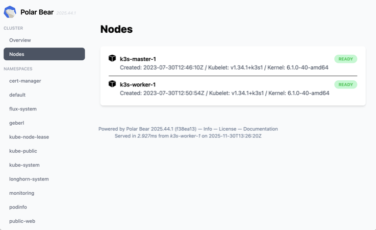
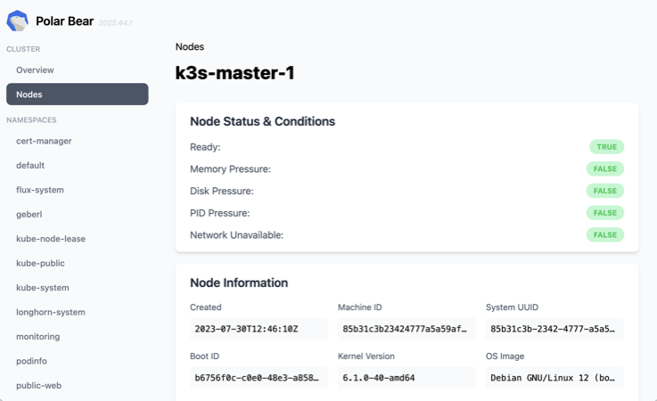
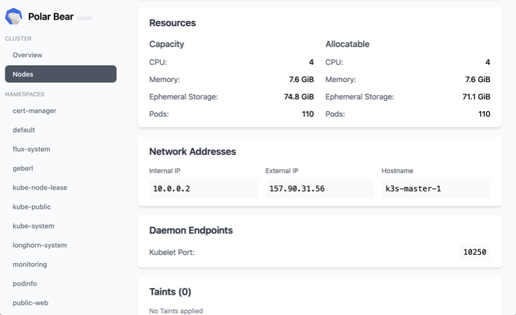
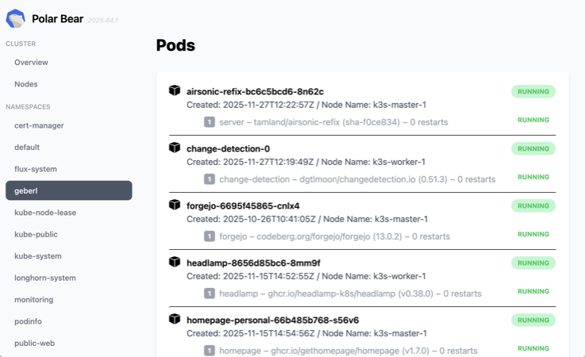
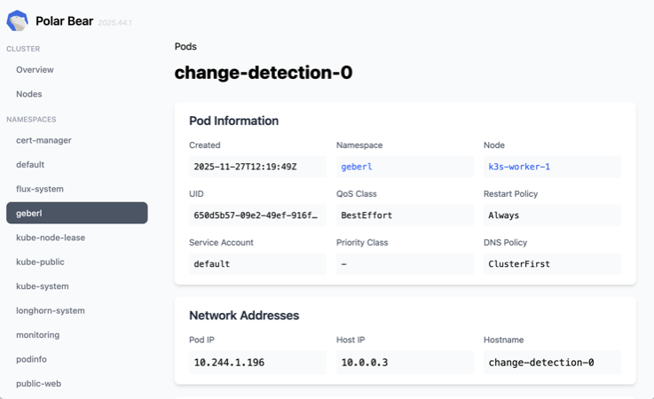

#  polar-bear

*A simple read-only Kubernetes dashboard.*


## Features

- **Read-only**: Assuming a gitops approach to cluster and workload management.
- **Self-contained**: Single container/executable with no external dependencies.
- **In-memory database**: Requests to polar-bear don't hit the Kubernetes api-server.
- **No auth**: Easy access locally, in homelab setups, behind a VPN or inside a Tailscale network.

## Heads Up

- This is **not a product**. This is **just [geberl's](https://github.com/geberl) hobby project**. One person, no contributors, no company-support.
- I know it has a cute animal logo. This still doesn't make it production-ready.
- Don't expect a 1.0 version any time soon (or ever). I have maybe 4 hours/month to work on this.
- For production use, consider [Headlamp](https://headlamp.dev/), the official [kubernetes/dashboard](https://github.com/kubernetes/dashboard), or a commercial SaaS solution.
- I will most definitely not help you debug your cluster. For anything else, feel free to [open an issue](https://github.com/geberl/polar-bear/issues). That I might then ignore.

## Screenshots

Node List:

[](assets/screenshot-nodes-full.png)

Node Details:

[](assets/screenshot-node-1-full.png)
[](assets/screenshot-node-2-full.png)

Pod List:

[](assets/screenshot-pods-full.png)

Pod Details:

[](assets/screenshot-pod-1-full.png)
[](assets/screenshot-pod-2-full.png)

## Features by Resource

### Namespaced Resources

| Resource | Live View | Detail Page | List Page | Counts |
| --- | --- | --- |--- |--- |
| Pod | ✔️ | ✔️ | ✔️ | ✔️ |
| Deployment | ➖ | ✔️ | ✔️ | ✔️ |
| ReplicaSet | ➖ | ➖ | ✔️ | ✔️  |
| StatefulSet | ➖ | ➖ | ✔️ | ✔️  |
| Service | ➖ | ➖ | ➖ | ✔️ |
| Ingress | ➖ | ➖ | ➖ | ✔️ |
| ConfigMap | ➖ | ➖ | ➖ | ➖  |

### Cluster-Wide Resources

| Resource | Sidebar | Detail Page | List Page |
| --- | --- | --- | --- |
| Node | ✔️ | ✔️ | ✔️ |
| CR | ➖ | ➖ | ➖ |

## Command Line Arguments

```shell
go run ./cmd/server/... --help

Usage of polar-bear:
  -cluster-name string
        name of the cluster (default "My Cluster")
  -devmode
        Use non-optimized Tailwind CSS file with all classes
  -hostname string
        name of the host that serves the application (default "My Host")
  -http-listen-address string
        http listen address (default "localhost:8888")
  -logformat string
        Format of logging, one of human/json (default "human")
  -loglevel string
        Verbosity of logging, one of debug/info/warn/error (default "info")
  -metrics-listen-address string
        metrics listen address (default "localhost:8889")
```

## Development

Run `polar-bear` locally, connecting to an existing remote cluster:

```shell
kubectx my-cluster
kubens my-namespace

export KUBECONFIG="$HOME/.kube/config-my-cluster.yaml"

export POLAR_BEAR_DEVMODE=true
export POLAR_BEAR_HOSTNAME="MacBook Pro"
export POLAR_BEAR_LOGLEVEL="debug"
export POLAR_BEAR_LOGFORMAT="color"

go run ./cmd/server/...
```

Then open `http://localhost:8888` in a browser.

## Deployment

Examples see `manifests` directory.

## Attributions

ChatGPT and Claude were used as research tools during development, similar to how one would use a search engine. Some generated code was copy-pasted, but all of it was manually reviewed. No autonomous agents were let loose on this repo (yet).

The logo was traced from a photo I took at the [Musée d’Orsay](https://www.musee-orsay.fr) in Paris, France. The artwork is [Ours blanc by François Pompon](https://www.musee-orsay.fr/en/artworks/ours-blanc-15496) (1922).
